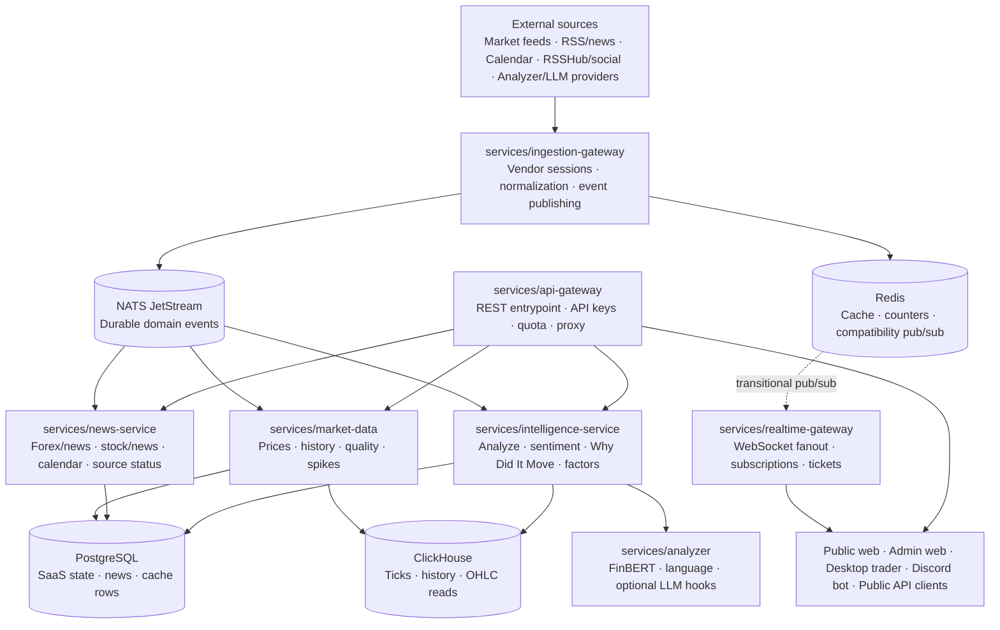
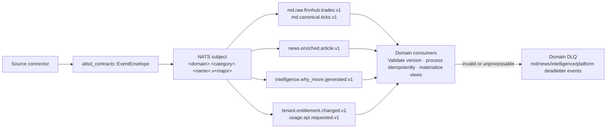

# ATLSD — Event-Driven Market Intelligence Platform

ATLSD is a multi-tenant market intelligence platform for market data, financial news, economic calendar context, sentiment enrichment, real-time streams, dashboards, and bot delivery.

The current architecture has moved away from a single `services/core` runtime. Public REST traffic now enters through `services/api-gateway`, real-time delivery is handled by `services/realtime-gateway`, and domain ownership is split across market data, news, intelligence, ingestion, and control-plane services.

## Core capabilities

- **Market data** for forex, crypto, indices, and configured symbols.
- **Financial news intelligence** from RSS/vendor sources, stock feeds, economic calendar data, and social/X-compatible ingestion paths.
- **NLP and catalyst analysis** through a Python analyzer runtime and Rust intelligence service.
- **Real-time client delivery** through a dedicated WebSocket gateway.
- **Multi-tenant SaaS controls** through users, plans, API keys, quotas, tenant configuration, and runtime entitlement checks.
- **Operational delivery** through public/admin web apps and a Discord bot.
- **Institutional target architecture** based on domain services, versioned event contracts, replayability, observability, and NATS JetStream as the durable event backbone.

## Current runtime topology



## Target event architecture

ATLSD uses versioned event contracts for durable domain communication. The preferred event backbone is **NATS JetStream**. Redis remains useful for cache, counters, hot state, and compatibility pub/sub during migration.



See:

- `docs/architecture/events.md` — event envelope, naming, versioning, replay, DLQ policy.
- `docs/architecture/target-institutional-platform.md` — long-term institutional platform topology and migration roadmap.

## Service map

```text
services/
  api-gateway/            Public REST gateway and quota/auth middleware
  realtime-gateway/       WebSocket gateway and real-time fanout
  market-data/            Prices, history, data quality, spikes, market sessions
  news-service/           Forex/news, stock news, calendar compatibility APIs
  intelligence-service/   Sentiment, analysis, Why Did It Move, factor outputs
  ingestion-gateway/      Vendor feed ingestion and event publishing
  control-plane/          Users, auth, plans, API keys, tenant config, usage
  analyzer/               Python FastAPI model runtime
  bot/                    Discord bot integration

crates/
  atlsd-auth/             JWT, API key hashing, encryption, auth helpers
  atlsd-common/           Config, errors, DB helpers, HTTP utilities
  atlsd-contracts/        Versioned event envelope and domain payload contracts
  atlsd-domain/           Shared tenant, plan, and usage domain models
  atlsd-eventbus/         NATS/Redis/dual-publisher event bus abstraction
  atlsd-observability/    Tracing/logging setup
```

## Public API routing

`services/api-gateway` is the public REST entrypoint. It keeps legacy `/api/v1/*` route compatibility while forwarding to domain services.

| Public route group | Owner service |
| --- | --- |
| `/health` | `api-gateway` |
| `/api/v1/market/prices` | `market-data` |
| `/api/v1/market/prices/{symbol}` | `market-data` |
| `/api/v1/market/history/{symbol}` | `market-data` |
| `/api/v1/market/session/{symbol}` | `market-data` |
| `/api/v1/market/data-quality` | `market-data` |
| `/api/v1/market/spikes` | `market-data` |
| `/api/v1/forex/news*` | `news-service` |
| `/api/v1/forex/calendar` | `news-service` |
| `/api/v1/forex/sources/status` | `news-service` |
| `/api/v1/stock/news` | `news-service` |
| `/api/v1/analyze` | `intelligence-service` |
| `/api/v1/market/why/{symbol}` | `intelligence-service` |

`services/realtime-gateway` is separate from the REST gateway. WebSocket clients should connect to realtime-gateway directly.

## Realtime gateway

Realtime gateway supports the current compatibility route surface:

```text
/api/v1/ws/v1
/api/v1/ws
/api/v1/ws/market
/api/v1/ws/market/{symbol}
/api/v1/ws/forex-news
/api/v1/ws/stock
/api/v1/ws/calendar
/api/v1/ws/x
/api/v1/ws/x/{username}
/api/v1/ws/ticket
```

Realtime gateway consumes market and news events from NATS subjects and broadcasts compatibility events such as `market.trade`, `forex_news.new`, and `stock.news.new` to subscribed clients. Redis remains available for hot state, compatibility, and operational counters.

## Market sessions and candle gating

`services/market-data` owns market session resolution. It hydrates a local in-memory cache from PostgreSQL calendar tables and refreshes it periodically with `MARKET_CALENDAR_REFRESH_SEC`.

Calendar tables:

- `market.exchanges` — exchange code, timezone, regular trading hours, working days.
- `market.exchange_holidays` — manual holiday and full-close overrides.
- `market.symbol_exchange_map` — symbol-to-exchange mapping for indices and equities.

The current seed covers US exchanges, Bursa Indonesia (`IDX`), major Asian exchanges, Australia, India, FX, and crypto. Configured major symbols include `SPX`, `DXY`, `N225`, `HSI`, `SSEC`, `KOSPI`, `STI`, `JCI`, `ASX200`, `NIFTY50`, `SENSEX`, large US equities such as `AAPL`, `MSFT`, `NVDA`, and configured IDX equities.

Latest prices may still update while a market is closed, but OHLCV candles are written only when the resolved session is open. This prevents after-hours/reference quotes from polluting chart history.

## Data stores

```mermaid
flowchart TB
    pg[(PostgreSQL)]
    ch[(ClickHouse)]
    redis[(Redis)]
    nats[(NATS JetStream)]

    pg --> pg1[Tenants · users · plans · API keys]
    pg --> pg2[Tenant config · usage logs]
    pg --> pg3[News · articles · source metadata]
    pg --> pg4[URL and intelligence cache rows]

    ch --> ch1[Market ticks]
    ch --> ch2[Market history]
    ch --> ch3[OHLC/time-series reads]
    ch --> ch4[Volatility/query workloads]

    redis --> r1[Cache and counters]
    redis --> r2[Quota state]
    redis --> r3[Tenant sync notifications]
    redis --> r4[Transitional realtime pub/sub]

    nats --> n1[Durable domain events]
    nats --> n2[Replayable streams]
    nats --> n3[DLQ workflows]
    nats --> n4[Schema-governed service communication]
```



## Local development

### Start infrastructure and services

```bash
make up
# or
make up ENGINE=docker
```

Compose files live in `infra/compose/`:

```bash
docker compose -f infra/compose/local.yml up -d
```

For production-shaped local builds, use the production compose file with the local build override:

```bash
docker compose -f infra/compose/prod.yml -f infra/compose/prod.build.yml build
docker compose -f infra/compose/prod.yml -f infra/compose/prod.build.yml up -d
```

Stop the stack:

```bash
make down
```

Tail logs:

```bash
make logs
```

### Rust workspace

Run from the repository root:

```bash
cargo build --workspace
cargo test --workspace
cargo fmt --all -- --check
cargo clippy --workspace --all-targets -- -D warnings
```

Run one service:

```bash
cargo run -p api-gateway
cargo run -p realtime-gateway
cargo run -p market-data
cargo run -p news-service
cargo run -p intelligence-service
cargo run -p control-plane
cargo run -p ingestion-gateway
cargo run -p bot
```

### Python analyzer

```bash
cd services/analyzer
pip install -r requirements.txt
python main.py
```

### Frontend apps

```bash
cd apps/public-web
bun install
bun run dev
bun run check
bun run lint
```

```bash
cd apps/admin-web
bun install
bun run dev
bun run check
bun run lint
```

## Environment files

Compose reads env files from `infra/env/`. Local env files are intentionally not committed when ignored by git.

| File | Used by |
| --- | --- |
| `.env.db` | PostgreSQL |
| `.env.api-gateway` | REST gateway |
| `.env.market-data` | Market data service |
| `.env.realtime-gateway` | WebSocket gateway |
| `.env.news-service` | News/calendar service |
| `.env.intelligence-service` | Intelligence service |
| `.env.control-plane` | SaaS control plane |
| `.env.ingestion` | Ingestion gateway |
| `.env.bot` | Discord bot |
| `.env.portal` | Public/admin frontend image build/runtime |
| `.env.rsshub` | RSSHub |
| `.env.analyze` | Python analyzer |

Important shared variables:

| Variable | Purpose |
| --- | --- |
| `DATABASE_URL` | PostgreSQL connection string. |
| `REDIS_URL` | Redis connection string for cache/counters/compatibility pub-sub. |
| `NATS_URL` | NATS server URL, usually `nats://nats:4222` in compose. |
| `EVENTBUS_MODE` | Event bus mode: `redis`, `nats`, or dual mode where supported. |
| `API_KEYS` | Static bootstrap API keys for gateway/realtime compatibility. |
| `JWT_SECRET` | Control-plane JWT signing secret. |
| `ADMIN_API_KEY` | Bootstrap admin key. |
| `AI_SERVICE_URL` | Analyzer base URL for intelligence service. |
| `CLICKHOUSE_URL` | ClickHouse HTTP endpoint for market/intelligence reads. |
| `MARKET_CALENDAR_REFRESH_SEC` | Market-data calendar cache refresh interval, default 300 seconds. |
| `INDEX_FEED_SYMBOLS` | Comma-separated `provider|public|asset_type` mappings for index/reference quote polling. |
| `STOCK_FEED_SYMBOLS` | Comma-separated `provider|public|asset_type` mappings for equity polling, including US and IDX symbols. |

## Deployment

GitHub Actions checks formatting, clippy, and tests, then builds and pushes changed Docker images. Production deploy pulls images on the VPS and starts `infra/compose/prod.yml`.

The VPS deploy path intentionally uses pull-based deployment so heavy image builds happen outside the VPS:

```text
git pull --ff-only
cd infra/compose
docker compose -f prod.yml pull
docker compose -f prod.yml up -d --remove-orphans
docker compose -f prod.yml ps
```

For local production-shaped builds, use `prod.build.yml` as an override.

## Verification checklist

Before shipping backend changes:

```bash
cargo fmt --all -- --check
cargo clippy --workspace --all-targets -- -D warnings
cargo test --workspace
```

Before shipping frontend changes:

```bash
cd apps/public-web
bun run check
bun run lint
```

```bash
cd apps/admin-web
bun run check
bun run lint
```

Manual smoke checks with services running:

```bash
curl http://localhost:8000/health
curl http://localhost:8000/api/v1/market/prices
curl http://localhost:8000/api/v1/market/session/SPX
curl http://localhost:8000/api/v1/market/session/BBCA
curl http://localhost:8000/api/v1/forex/news/latest
curl http://localhost:8000/api/v1/stock/news
curl http://localhost:8000/api/v1/market/why/XAUUSD
```

Realtime smoke test:

```text
ws://localhost:8020/api/v1/ws?api_key=<key>&channels=all
```

## Production notes

- Keep `api-gateway` and `realtime-gateway` independently scalable.
- Keep market hot-path processing separate from NLP, LLM, scraping, and analytical workloads.
- Use NATS JetStream for durable domain events and replayable workflows.
- Keep Redis focused on cache, counters, hot state, and transitional compatibility pub/sub.
- Use ClickHouse for market time-series and chart/history reads.
- Treat API keys, JWT secrets, OAuth credentials, provider keys, and LLM keys as secrets.
- Monitor ingestion lag, event bus consumer lag, tick-to-client latency, WebSocket drops, API p95/p99, analyzer latency, data quality events, and tenant quota denials.
