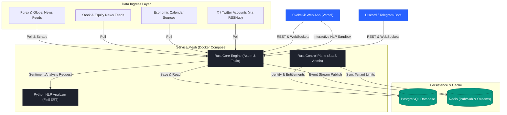

# ATLSD Platform

ATLSD is a real-time market intelligence and data distribution platform. It aggregates multi-source financial feeds, performs real-time Natural Language Processing (NLP) sentiment analysis, and distributes data via WebSockets and REST APIs under a tenant-aware subscription model.

---

## Architecture Diagram

Below is the platform's service-oriented architecture, showing data flow from ingestion to final client distribution:



---

## How It Works

The platform operates through five coordinated stages:

### 1. Multi-Source Ingress
* **News & Market Calendars:** The Core service runs scheduled worker threads to poll external global news RSS feeds and economic calendar events.
* **Social Feeds:** Aggregates X (Twitter) posts via a unified RSSHub instance. It merges global configurations with custom, per-tenant user lists.
* **Stock & Equity News:** Collects updates from regional equity markets and schedules regular checks for new publications.

### 2. Natural Language Processing (NLP) Pipeline
When news articles are fetched, they enter the Core processing pipeline:
1. **Extraction & Sanitization:** Article HTML is parsed, stripped of boilerplate elements, and sanitized into plaintext.
2. **Tone Analysis:** The Core service forwards the sanitized title and content to the Python **NLP Analyzer** service.
3. **FinBERT Prediction:** The analyzer uses Hugging Face's `yiyanghkust/finbert-tone` model to evaluate whether the text has a *positive*, *negative*, or *neutral* tone, outputting a prediction, confidence scores, and sentence-level highlights.
4. **Database Commit:** The computed sentiment and extracted metadata (e.g. currencies, stock tickers) are committed to PostgreSQL.

### 3. Real-Time Distribution
* **Redis Streams:** Processed events are published to Redis Streams (e.g. `world-info:stream:news:ingest`) for fan-out processing.
* **Active WebSockets:** The Core WS Hub pushes news alerts and economic calendar events to all connected clients (browser apps, bots) with sub-second latency.

### 4. Tenant Governance (SaaS Control Plane)
* Access validation utilizes either secure JWTs or hashed API keys.
* When a client connects, the system fetches the active plan configuration (limits on daily requests, max concurrent WebSockets, and restricted tickers/symbols).
* Requests increment counters in Redis. If a tenant exceeds their plan quota, the request is throttled (rate-limited), ensuring resource isolation.

### 5. Frontend & Interactive AI Sandbox
* The **SvelteKit Web App** provides a dashboard with live news, and an economic calendar.
* Users can use the **AI Sentiment Analyzer** sandbox to paste any custom financial text (headlines, press releases) to see the FinBERT model's probability distribution and color-coded sentiment highlights in real time.

---

## Core Components

1. **Core Service (Rust, Axum, Tokio):** The high-throughput data collector, API gateway, and WebSocket server. Runs embedded migrations and handles telemetry.
2. **Control Plane (Rust, Axum):** The identity, key management, and subscription ledger. Authorizes tenant plans and updates limits.
3. **NLP Analyzer (Python, FastAPI, PyTorch):** Houses the `finbert-tone` transformer model. Performs entity parsing (currencies, tickers) and tone highlights.
4. **Web App (SvelteKit, Tailwind CSS v4):** High-performance frontend deployed on Vercel. Renders live market data and the interactive NLP sandbox.

---

## Repository Structure

```text
├── apps/
│   └── public-web/          # SvelteKit dashboard application (Tailwind v4, Vercel deployment)
├── services/
│   ├── core/                # Rust core engine (ingestion pipelines & WebSocket hub)
│   ├── control-plane/       # Rust SaaS administration panel (identities, plans, API keys)
│   ├── analyzer/            # Python FastAPI service (FinBERT NLP model)
│   ├── bot/                 # Telegram/Discord notifications agent
│   └── ingestion-gateway/   # High-speed data ingest adapter
├── db/
│   └── migrations/          # Embedded SQLx schema files for SaaS & market databases
└── infra/
    ├── compose/             # Docker Compose files (local.yml, prod.yml)
    ├── docker/              # Component-specific Dockerfiles
    └── env/                 # Multi-environment variable templates
```

---

## Getting Started

### Prerequisites
* Docker & Docker Compose
* Node.js & Bun (for frontend development)
* Rust toolchain (for local backend development)

### Local Stack (Docker)
1. Copy the environment variables:
   ```bash
   cp infra/env/.env.core.example infra/env/.env.core
   # Fill in variables in infra/env/.env.* files
   ```
2. Start the local development compose stack:
   ```bash
   docker compose -f infra/compose/local.yml up --build
   ```
   * **Core Service API:** `http://localhost:8090`
   * **Control Plane API:** `http://localhost:8081`
   * **NLP Analyzer Service:** `http://localhost:5000`

### Frontend Development (Outside Docker)
The web app is deployed directly to Vercel in production. To run it locally for development:
1. Navigate to the web app:
   ```bash
   cd apps/public-web
   ```
2. Install dependencies and start the dev server:
   ```bash
   bun install
   bun run dev
   ```
3. Open `http://localhost:5173` in your browser.
