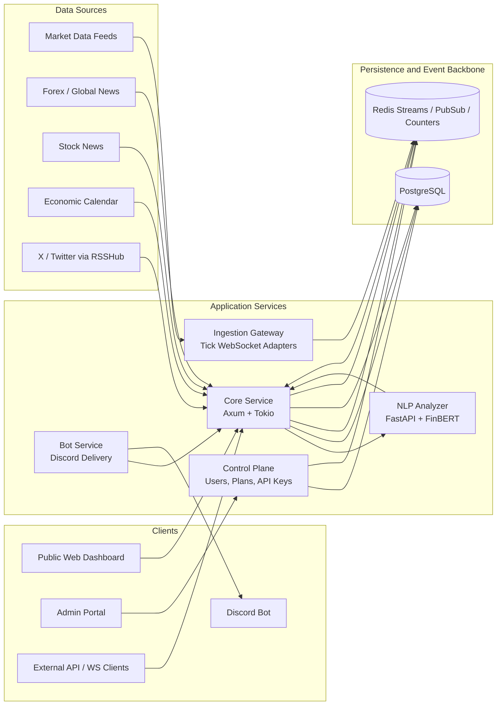

# ATLSD — Real-time Market Intelligence Platform

ATLSD is a multi-tenant market intelligence platform for real-time prices, financial news, economic calendar events, X/Twitter feeds, NLP sentiment enrichment, REST APIs, provider-style WebSocket streams, dashboards, and Discord delivery.

The platform is built as a SaaS-ready data system: the **core data plane** ingests and distributes market events, while the **control plane** manages users, plans, API keys, quotas, tenant configuration, and runtime entitlements.

## Core capabilities

- **Real-time market data** for forex, crypto, indices, and configured market symbols.
- **Financial news intelligence** from forex/global feeds, stock feeds, RSS sources, and X/Twitter via RSSHub.
- **Economic calendar monitoring** for high-impact macro events.
- **NLP sentiment enrichment** through a dedicated Python analyzer service using FinBERT.
- **Provider-style WebSocket API** at `/ws/v1` with dynamic `SUBSCRIBE`, `UNSUBSCRIBE`, `LIST_SUBSCRIPTIONS`, and `PING` commands.
- **Multi-tenant SaaS enforcement** with API keys, JWT sessions, plan limits, usage tracking, WebSocket connection caps, symbol limits, and tenant allowlists.
- **Public dashboard and portal integration** through SvelteKit apps.
- **Discord bot delivery** for market alerts, news alerts, calendar reminders, volatility events, and configured X/Twitter feeds.

## Architecture



### Data plane

`services/core` is the primary runtime gateway. It handles ingestion pipelines, REST APIs, WebSocket sessions, Redis fan-out, tenant validation, API key validation, plan enforcement, and event persistence.

### Control plane

`services/control-plane` manages SaaS state: users, OAuth, JWT sessions, API keys, plans, tenant configs, usage, and cache sync events. Core reads this state through PostgreSQL and Redis-backed refresh notifications.

### Analyzer

`services/analyzer` is isolated from the Rust data plane so NLP inference can be scaled independently. Core sends normalized text to the analyzer and stores sentiment labels, confidence scores, probabilities, highlights, and entities.

### Frontends

- `apps/public-web` — public product site, live market dashboard, documentation, and portal entry points.
- `apps/admin-web` — tenant/admin portal for API keys, usage, plans, and configuration.

## Provider-style WebSocket API

New integrations should connect to a single endpoint:

```text
GET /ws/v1?api_key=YOUR_API_KEY
```

Supported auth options:

- `api_key` — tenant API key.
- `token` — JWT session token.
- `ticket` — short-lived WebSocket ticket.

After the socket opens, clients send JSON commands.

### Subscribe

```json
{ "method": "SUBSCRIBE", "params": ["market_data:XAUUSD", "forex_news"], "id": 1 }
```

Success response:

```json
{ "result": null, "id": 1 }
```

### Unsubscribe

```json
{ "method": "UNSUBSCRIBE", "params": ["market_data:XAUUSD"], "id": 2 }
```

### List active streams

```json
{ "method": "LIST_SUBSCRIPTIONS", "id": 3 }
```

Example response:

```json
{ "result": ["forex_news"], "id": 3 }
```

### Ping

```json
{ "method": "PING", "id": 4 }
```

Example response:

```json
{ "result": "pong", "id": 4 }
```

### Canonical stream names

| Stream | Description |
| --- | --- |
| `market_data` | All market ticks allowed by the tenant plan. |
| `market_data:XAUUSD` | One market symbol. Counts toward `tv_symbols_max`. |
| `forex_news` | Forex and global market news. |
| `stock_news` | Stock/equity news, subject to plan access. |
| `calendar` | Economic calendar reminders, subject to plan access. |
| `high_impact` | High-impact news or macro alerts. |
| `volatility` | Volatility spike alerts. |
| `x` | All configured X/Twitter feed events allowed by the tenant plan. |
| `x:federalreserve` | One X/Twitter username. Counts toward `x_usernames_max`. |
| `system` | Operational/system status events. |
| `all` | Compatibility stream for internal/bot clients. |


## SaaS plan enforcement

Runtime checks are enforced by Core using tenant context loaded from the control plane.

| Limit | Enforced at | Source |
| --- | --- | --- |
| REST request quota | HTTP request middleware | `plans.requests_per_day` |
| Rate limit per minute | HTTP request middleware | `plans.rate_limit_per_min` |
| WebSocket connection count | WebSocket connect | `plans.ws_connections` |
| Market symbol subscription count | WebSocket subscribe | `plans.tv_symbols_max` |
| X username subscription count | WebSocket subscribe | `plans.x_usernames_max` |
| Market symbol allowlist | WebSocket subscribe | `tenant_configs.tv_symbols` |
| X username allowlist | WebSocket subscribe | `tenant_configs.x_usernames` |
| Premium stream access | WebSocket subscribe | tenant plan |

## Repository structure

```text
apps/
  public-web/              Public SvelteKit dashboard and documentation
  admin-web/               Tenant/admin portal

crates/
  atlsd-auth/              JWT, API keys, encryption, auth extractors
  atlsd-common/            Config, errors, DB helpers, shared utilities
  atlsd-domain/            Shared tenant, plan, and usage models
  atlsd-observability/     Tracing/logging setup

services/
  core/                    Main data plane: ingestion, REST, WebSocket, tenants
  control-plane/           SaaS management: users, plans, keys, configs, usage
  ingestion-gateway/       Tick-level market data ingestion adapters
  analyzer/                Python FastAPI NLP analyzer
  bot/                     Discord bot integration

db/
  migrations/core/         PostgreSQL schema and migrations

infra/
  compose/                 Local compose environments
  docker/                  Service Dockerfiles
  env/                     Environment templates
```

## Local development

### Infrastructure

```bash
make up
# or
make up ENGINE=docker
```

Stop the stack:

```bash
make down
```

Tail logs:

```bash
make logs
```

### Rust backend

Run from the repository root:

```bash
cargo build --workspace
cargo test --workspace
cargo fmt --all -- --check
cargo clippy --workspace --all-targets -- -D warnings
```

Run one service crate:

```bash
cargo run -p core
cargo run -p control-plane
```

### Public web app

```bash
cd apps/public-web
bun install
bun run dev
bun run check
bun run lint
```

### Admin web app

```bash
cd apps/admin-web
bun install
bun run dev
bun run check
bun run lint
```

### NLP analyzer

```bash
cd services/analyzer
pip install -r requirements.txt
python main.py
```

## Important environment variables

### Core

| Variable | Purpose |
| --- | --- |
| `DATABASE_URL` | PostgreSQL connection string. |
| `REDIS_URL` | Redis connection string. |
| `API_KEYS` | Bootstrap/static API keys if configured. |
| `PORT` | Core HTTP port. |
| `RSS_FETCH_SEC` | Forex/global news polling interval. |
| `STOCK_FETCH_SEC` | Stock news polling interval. |
| `CALENDAR_CHECK_SEC` | Economic calendar polling interval. |
| `RSSHUB_URL` | RSSHub base URL for X/Twitter feeds. |
| `X_USERNAMES` | Global X/Twitter usernames. |
| `REDIS_CHANNEL_PREFIX` | Redis pub/sub namespace. |

### Control plane

| Variable | Purpose |
| --- | --- |
| `DATABASE_URL` | PostgreSQL connection string. |
| `REDIS_URL` | Redis connection string. |
| `JWT_SECRET` | JWT signing secret. |
| `JWT_EXPIRY_DAYS` | Session lifetime. |
| `ADMIN_API_KEY` | Bootstrap admin key. |
| `FRONTEND_URL` | Portal/public frontend origin. |
| `ENCRYPTION_KEY` | Encryption key for stored secrets. |
| `GOOGLE_CLIENT_ID` / `GOOGLE_CLIENT_SECRET` | Google OAuth. |
| `GITHUB_CLIENT_ID` / `GITHUB_CLIENT_SECRET` | GitHub OAuth. |

## Verification checklist

Before shipping backend changes:

```bash
cargo fmt --all -- --check
cargo clippy --workspace --all-targets -- -D warnings
cargo test --workspace
```

Before shipping public-web changes:

```bash
cd apps/public-web
bun run check
bun run lint
```

Manual WebSocket smoke test:

1. Connect to `/ws/v1?api_key=...`.
2. Send `SUBSCRIBE` for `market_data:XAUUSD` and `forex_news`.
3. Confirm `{ "result": null, "id": ... }`.
4. Confirm incoming events include `stream`.
5. Send `LIST_SUBSCRIPTIONS`.
6. Send `UNSUBSCRIBE` and confirm future matching events stop.
7. Check legacy `/api/v1/ws/*` clients still connect if compatibility is required.

## Production notes

- Run Core replicas behind a load balancer that supports WebSocket upgrades.
- Use managed PostgreSQL with backups and point-in-time recovery.
- Use managed Redis or a Redis-compatible service for pub/sub, stream fan-out, tenant sync, and counters.
- Keep analyzer capacity independent from Core so NLP latency does not block the real-time data plane.
- Monitor active WebSocket connections, rejected subscriptions, tenant quota errors, Redis stream lag, ingestion failures, and NLP inference latency.
- Treat API keys as secrets; raw keys are shown once and stored only as hashes.
