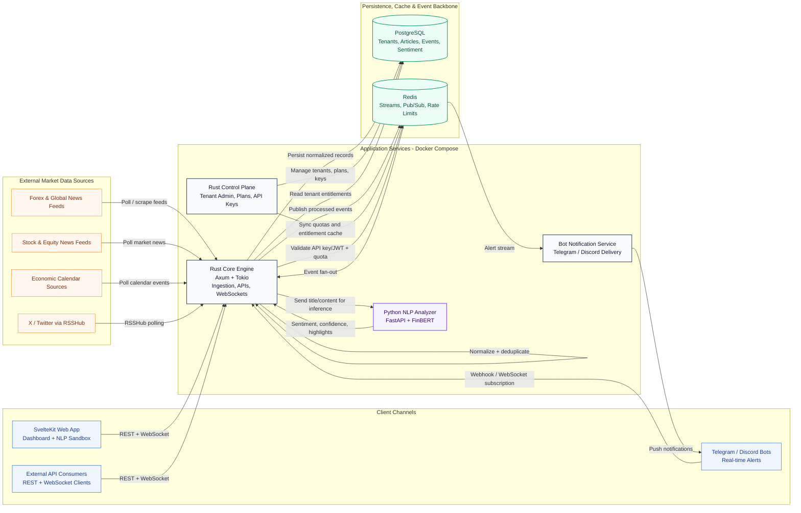
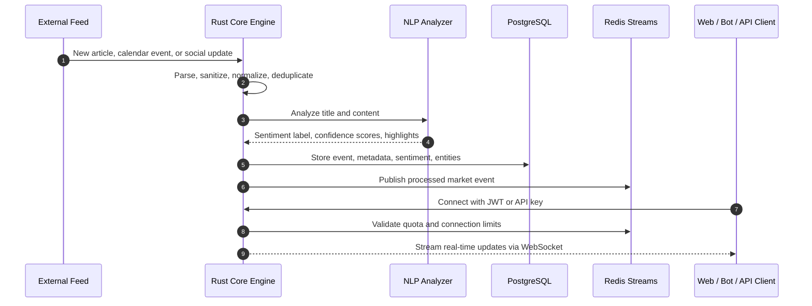
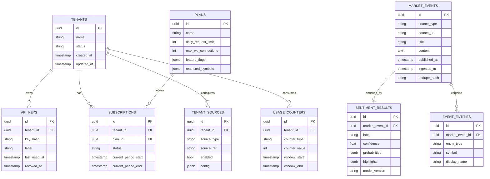

# ATLSD Platform

ATLSD is a real-time market intelligence and data distribution platform for financial news, economic calendar events, market signals, and tenant-aware data delivery. The platform aggregates multiple financial information sources, enriches incoming content with Natural Language Processing (NLP), and distributes structured market intelligence through REST APIs, WebSockets, dashboards, and bot integrations.


The system is designed around four main goals:

* **Low-latency market intelligence delivery** for dashboards, bots, and API consumers.
* **Reliable multi-source ingestion** from news feeds, market calendars, equity feeds, and social sources.
* **AI-assisted sentiment enrichment** using a dedicated NLP analyzer service.
* **SaaS-ready tenant governance** with plans, limits, API keys, quotas, and entitlement checks.

---

## 1. Platform Architecture

The architecture follows a service-oriented model. The Rust Core Engine acts as the primary ingestion, processing, API, and WebSocket gateway. The Control Plane manages tenants, subscriptions, plans, API keys, and entitlement rules. The Python NLP Analyzer is isolated as a dedicated AI inference service so that model execution can scale independently from the real-time data plane.



---

## 2. End-to-End Data Flow

The platform processes market information through six coordinated stages: ingestion, normalization, enrichment, persistence, publication, and distribution.



---

## 3. Key Platform Capabilities

### 3.1 Multi-Source Ingestion

The Core Engine runs scheduled workers that collect and normalize market information from multiple sources:

* Forex and global market news feeds.
* Regional stock and equity news feeds.
* Economic calendar sources.
* X / Twitter accounts aggregated through RSSHub.
* Tenant-specific social watchlists merged with global source configuration.

Each ingested item is normalized into a consistent internal event format before further processing.

### 3.2 NLP Sentiment Pipeline

When a news article or social post is fetched, the Core Engine sends sanitized text to the Python NLP Analyzer. The analyzer uses the FinBERT tone model to classify financial sentiment as **positive**, **negative**, or **neutral**.

The NLP output includes:

* Sentiment label.
* Confidence score.
* Class probability distribution.
* Sentence-level highlights.
* Extracted financial entities such as currencies, tickers, or instruments.

### 3.3 Real-Time Distribution

Processed events are published into Redis Streams and delivered to connected clients through WebSockets. This allows dashboards, bots, and external API consumers to receive market updates with low latency.

Typical distribution channels include:

* SvelteKit dashboard live feed.
* Telegram and Discord alert bots.
* REST API consumers.
* WebSocket subscribers.

### 3.4 Tenant Governance

The Control Plane manages SaaS administration and authorization logic. It stores tenant profiles, plan definitions, API keys, subscription state, and entitlement rules in PostgreSQL.

The Core Engine validates access at runtime using JWTs or hashed API keys. Usage counters and connection limits are cached in Redis to reduce database load and support high-frequency checks.

Governed resources include:

* Daily REST API request limits.
* Maximum concurrent WebSocket connections.
* Access to restricted symbols, tickers, or asset classes.
* Plan-specific feature availability.
* Tenant-specific source subscriptions.

---

## 4. Core Components

| Component     | Technology                        | Responsibility                                                                         |
| ------------- | --------------------------------- | -------------------------------------------------------------------------------------- |
| Core Engine   | Rust, Axum, Tokio                 | Ingestion, API gateway, WebSocket hub, event normalization, tenant runtime enforcement |
| Control Plane | Rust, Axum                        | Tenant management, plans, subscriptions, API keys, entitlements                        |
| NLP Analyzer  | Python, FastAPI, PyTorch, FinBERT | Financial sentiment inference, confidence scoring, text highlights, entity extraction  |
| Web App       | SvelteKit, Tailwind CSS, Vercel   | Market intelligence dashboard, live feed, NLP sandbox                                  |
| Bot Service   | Telegram / Discord integrations   | Push alerts and user-facing notifications                                              |
| PostgreSQL    | SQL database                      | Durable storage for tenants, plans, articles, events, sentiment results, audit data    |
| Redis         | Streams, Pub/Sub, counters        | Event fan-out, rate limiting, quota tracking, real-time cache                          |

---

## 5. Suggested Database Model

The following logical schema supports the core SaaS and market intelligence features.



---

## 6. Repository Structure

```text
├── apps/
│   └── public-web/              # SvelteKit dashboard application
│
├── services/
│   ├── core/                    # Rust core engine: ingestion, APIs, WebSockets
│   ├── control-plane/           # Rust SaaS admin: tenants, plans, API keys
│   ├── analyzer/                # Python FastAPI service: FinBERT NLP model
│   ├── bot/                     # Telegram and Discord notification agent
│   └── ingestion-gateway/       # Optional high-speed ingestion adapter
│
├── db/
│   └── migrations/              # SQLx migrations and schema definitions
│
└── infra/
    ├── compose/                 # Docker Compose environments
    ├── docker/                  # Component-specific Dockerfiles
    └── env/                     # Environment variable templates
```

---

## 7. Local Development

### Prerequisites

* Docker and Docker Compose.
* Node.js and Bun for frontend development.
* Rust toolchain for backend development.
* Python runtime for the NLP analyzer if running outside Docker.

### Run the Local Stack

```bash
cp infra/env/.env.core.example infra/env/.env.core
# Fill in the required environment variables.

docker compose -f infra/compose/local.yml up --build
```

Local service endpoints:

| Service           | URL                     |
| ----------------- | ----------------------- |
| Core Service API  | `http://localhost:8090` |
| Control Plane API | `http://localhost:8081` |
| NLP Analyzer API  | `http://localhost:5000` |

### Run the Frontend Locally

```bash
cd apps/public-web
bun install
bun run dev
```

Open the dashboard at:

```text
http://localhost:5173
```

---

## 8. Production Notes

For production, the platform should be deployed with clear separation between the real-time data plane and the administrative control plane.

Recommended production considerations:

* Run Core Engine replicas behind a load balancer.
* Use managed PostgreSQL with automated backups and point-in-time recovery.
* Use managed Redis or a highly available Redis-compatible service.
* Isolate the NLP Analyzer with independent CPU/GPU scaling.
* Add structured logging, tracing, and metrics across all services.
* Protect APIs with JWT validation, API key hashing, tenant-level rate limits, and audit logging.
* Define Redis Stream retention policies to prevent unbounded memory growth.
* Add dead-letter handling for failed ingestion or NLP processing jobs.

---

## 9. Observability Checklist

| Area            | Recommended Metric / Signal                                              |
| --------------- | ------------------------------------------------------------------------ |
| Ingestion       | Feed polling latency, failed fetch count, deduplication rate             |
| NLP             | Inference latency, model error rate, queue depth, sentiment distribution |
| API             | Request latency, status codes, tenant-level usage                        |
| WebSocket       | Active connections, messages delivered, dropped connections              |
| Redis           | Stream length, consumer lag, memory usage                                |
| PostgreSQL      | Query latency, connection pool saturation, storage growth                |
| SaaS Governance | Quota violations, rejected API keys, plan entitlement failures           |
